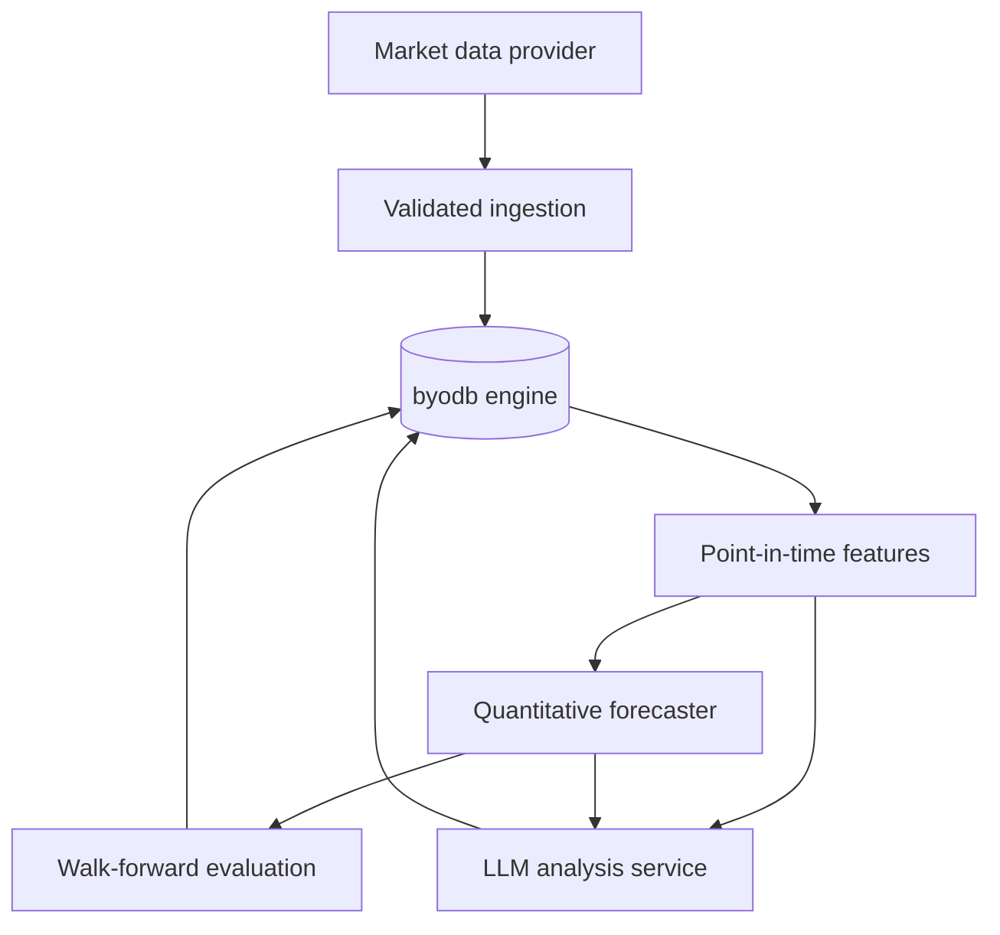

# Architecture

## System boundary

The database is an embedded single-process Go engine. The market package is a
domain layer, not a fork of the storage engine. It uses public transactions,
records, composite indexes, and scans in the same way an external application
would.

## Storage model

Prices use `PriceScale = 1,000,000`. A stored close of `123,456,789` means
`123.456789` currency units. Returns, volatility, confidence, sentiment, and
RSI use parts per million (`RatioScale = 1,000,000`). Floating-point arithmetic
is restricted to feature calculation and presentation; persisted values are
deterministic integers.

| Table | Primary key | Purpose |
| --- | --- | --- |
| `market_schema_migrations` | `version` | Atomic application schema history |
| `market_instruments` | `symbol` | Tradable instrument metadata |
| `market_candles` | `symbol, interval, timestamp` | Source-labelled OHLCV history |
| `market_features` | `symbol, interval, timestamp, feature_set` | Versioned point-in-time feature snapshots |
| `market_model_runs` | `run_id` | Model, parameters, data hash, metrics, and status |
| `market_forecasts` | `run_id, symbol, interval, as_of_timestamp, horizon_seconds` | Predictions and later realized outcomes |
| `market_analyses` | `analysis_id` | LLM thesis, evidence, model/prompt identity, input digest |
| `market_ingestion_checkpoints` | `source, dataset, symbol, interval` | Resumable provider progress |

Secondary indexes support cross-sectional timestamp scans, model/status
queries, forecast evaluation by target timestamp, and analysis lookup by
symbol and time.

## Correctness invariants

- A candle batch is fully validated before its transaction begins.
- OHLC prices must be positive; `high` and `low` must contain open and close.
- Re-importing the same candles is idempotent.
- Feature queries read only timestamps `<= as_of_timestamp`.
- A forecast keeps both `as_of_timestamp` and `target_timestamp`.
- Evaluation adds actual outcomes without replacing original model output.
- Each model run stores a deterministic SHA-256 hash of its candle dataset.
- Each LLM analysis stores the provider, model, prompt version, and SHA-256
  digest of its exact structured input.
- Storage commits retain the engine's copy-on-write, `fsync`, snapshot, and
  optimistic-conflict guarantees.

## LLM boundary

`LLMClient` is a dependency-injected interface. The repository contains no API
keys and the market logic does not depend on a particular vendor. A provider
adapter must return a typed `LLMResponse`; the service validates sentiment and
confidence ranges before persistence.

The current prompt receives structured recent candles and a computed feature
snapshot. News retrieval, source citations, and prompt-injection isolation are
scheduled for a later phase. Until then, the prompt explicitly forbids invented
news and limits claims to supplied evidence.

## Known limits

- One process may open a database file at a time.
- SQL is the book's simplified dialect; the market repository uses typed APIs.
- No live provider or hosted LLM adapter is committed yet.
- Technical features are a starting set, not evidence of profitable alpha.
- The baseline intentionally predicts the previous adjusted close. Later models
  must beat it on held-out periods and multiple assets before they are promoted.
