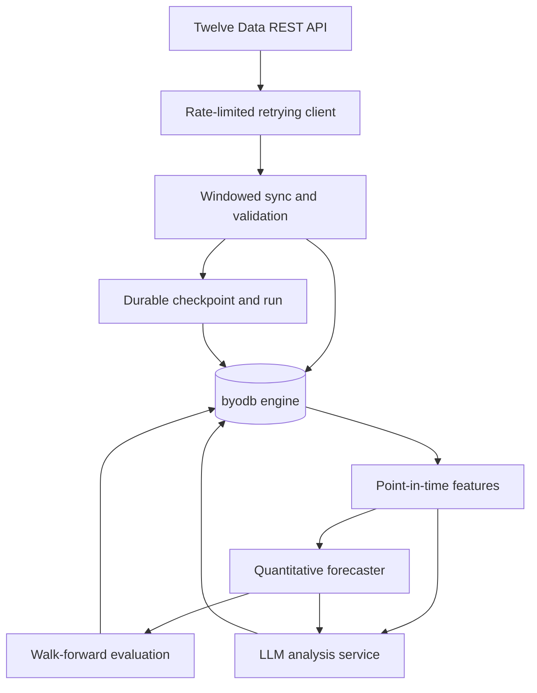
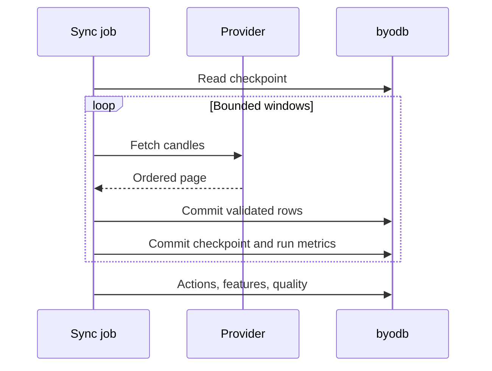

# Architecture

## System boundary

The database is an embedded single-process Go engine. The market package is a
domain layer, not a fork of the storage engine. It uses public transactions,
records, composite indexes, and scans in the same way an external application
would.

## Provider synchronization

`MarketDataProvider` separates orchestration from the provider SDK. The Twelve
Data implementation requests no more than 5,000 points per call, uses a shared
spaced limiter, retries transient network errors, HTTP 429, and HTTP 5xx with
bounded exponential backoff, honors `Retry-After`, limits response bodies, and
redacts the configured API key from provider errors.

`SyncService` converts the requested range into bounded, inclusive windows. It
commits each candle page before advancing its durable checkpoint. If the
process stops between those two commits, the next run replays the page safely
because candle and corporate-action writes are idempotent. A two-period resume
overlap also allows recently corrected bars to be updated.

## Storage model

Prices use `PriceScale = 1,000,000`. A stored close of `123,456,789` means
`123.456789` currency units. Returns, volatility, confidence, sentiment, and
RSI use parts per million (`RatioScale = 1,000,000`). Floating-point arithmetic
is restricted to feature calculation and presentation; persisted values are
deterministic integers.

| Table | Primary key | Purpose |
| --- | --- | --- |
| `market_schema_migrations` | `version` | Atomic application schema history |
| `market_instruments` | `symbol` | Tradable instrument metadata |
| `market_candles` | `symbol, interval, timestamp` | Source-labelled OHLCV history |
| `market_features` | `symbol, interval, timestamp, feature_set` | Versioned point-in-time feature snapshots |
| `market_model_runs` | `run_id` | Model, parameters, data hash, metrics, and status |
| `market_forecasts` | `run_id, symbol, interval, as_of_timestamp, horizon_seconds` | Predictions and later realized outcomes |
| `market_analyses` | `analysis_id` | LLM thesis, evidence, model/prompt identity, input digest |
| `market_ingestion_checkpoints` | `source, dataset, symbol, interval` | Resumable provider progress |
| `market_corporate_actions` | `symbol, action_type, ex_date, source` | Split/dividend lineage and exact factors |
| `market_data_quality_runs` | `report_id` | Coverage, missing/unexpected sessions, anomalies, and dataset hash |
| `market_ingestion_runs` | `run_id` | Job status, row counts, retries, credits, and bounded failure text |
| `market_feature_watermarks` | `symbol, interval, feature_set` | Durable incremental-computation progress |

Secondary indexes support cross-sectional timestamp scans, model/status
queries, forecast evaluation by target timestamp, and analysis lookup by
symbol and time.

## Correctness invariants

- A candle batch is fully validated before its transaction begins.
- OHLC prices must be positive; `high` and `low` must contain open and close.
- Re-importing the same candles is idempotent.
- Provider windows are bounded and filtered to the requested inclusive range.
- A checkpoint advances only after its candle page commits.
- Resume overlaps recent data and updates corrections without duplicating rows.
- Daily NYSE coverage distinguishes missing sessions from provider rows on
  non-session dates.
- Daily/weekly/monthly Twelve Data prices are not adjusted twice. Intraday
  split adjustment uses exact rational split factors from stored actions.
- Incremental features recompute with sufficient lookback context and update
  their watermark only after successful writes.
- Feature queries read only timestamps `<= as_of_timestamp`.
- A forecast keeps both `as_of_timestamp` and `target_timestamp`.
- Evaluation adds actual outcomes without replacing original model output.
- Each model run stores a deterministic SHA-256 hash of its candle dataset.
- Each LLM analysis stores the provider, model, prompt version, and SHA-256
  digest of its exact structured input.
- Storage commits retain the engine's copy-on-write, `fsync`, snapshot, and
  optimistic-conflict guarantees.

## LLM boundary

`LLMClient` is a dependency-injected interface. The repository contains no API
keys and the market logic does not depend on a particular vendor. A provider
adapter must return a typed `LLMResponse`; the service validates sentiment and
confidence ranges before persistence.

The current prompt receives structured recent candles and a computed feature
snapshot. News retrieval, source citations, and prompt-injection isolation are
scheduled for a later phase. Until then, the prompt explicitly forbids invented
news and limits claims to supplied evidence.

## Known limits

- One process may open a database file at a time.
- SQL is the book's simplified dialect; the market repository uses typed APIs.
- Twelve Data is the only live market-data adapter; adding another provider
  requires implementing `MarketDataProvider`.
- The exchange calendar covers NYSE daily sessions and known full-day special
  closures. It does not model early closes, non-US exchanges, or intraday gaps.
- Provider sync is sequential across symbols so one limiter owns the account
  budget. It is intentionally conservative, not a high-throughput downloader.
- Corporate-action adjustment covers splits for intraday adjusted-close
  reconstruction; dividend total-return adjustment is not claimed.
- A hosted LLM adapter is not committed yet.
- Technical features are a starting set, not evidence of profitable alpha.
- The baseline intentionally predicts the previous adjusted close. Later models
  must beat it on held-out periods and multiple assets before they are promoted.
