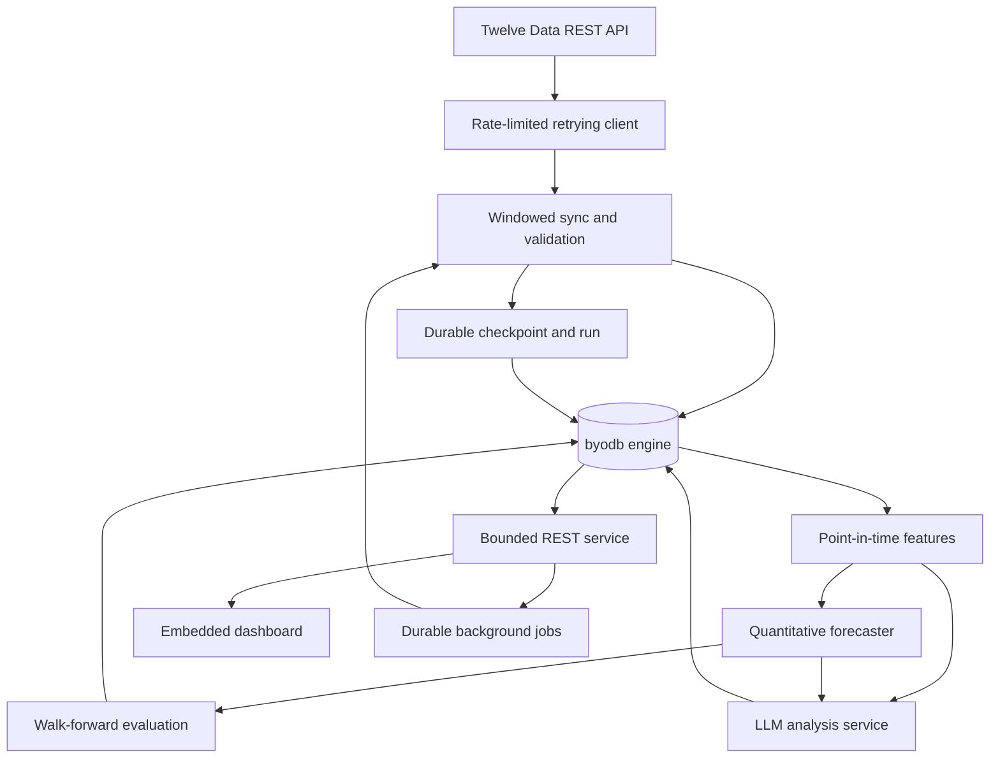
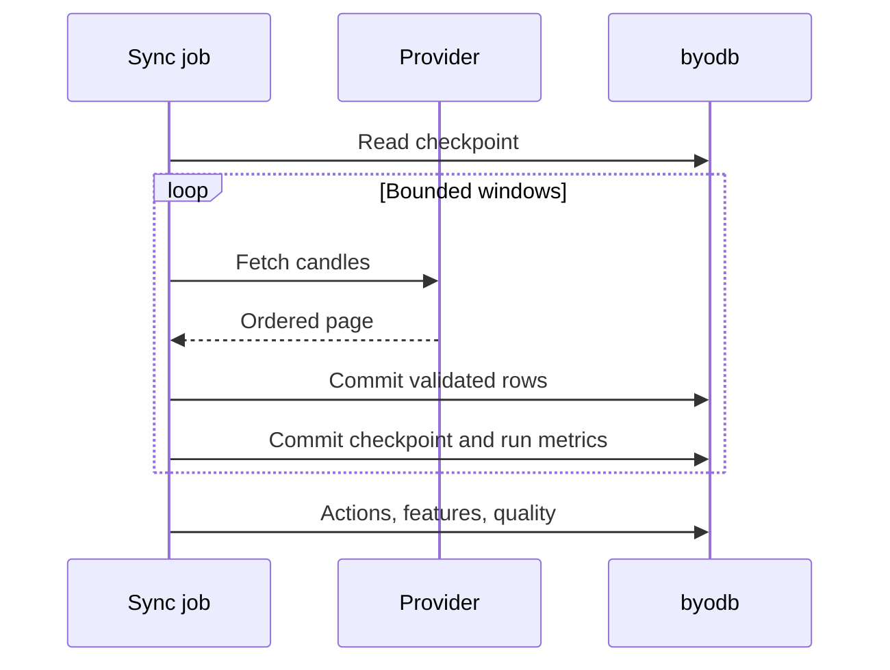
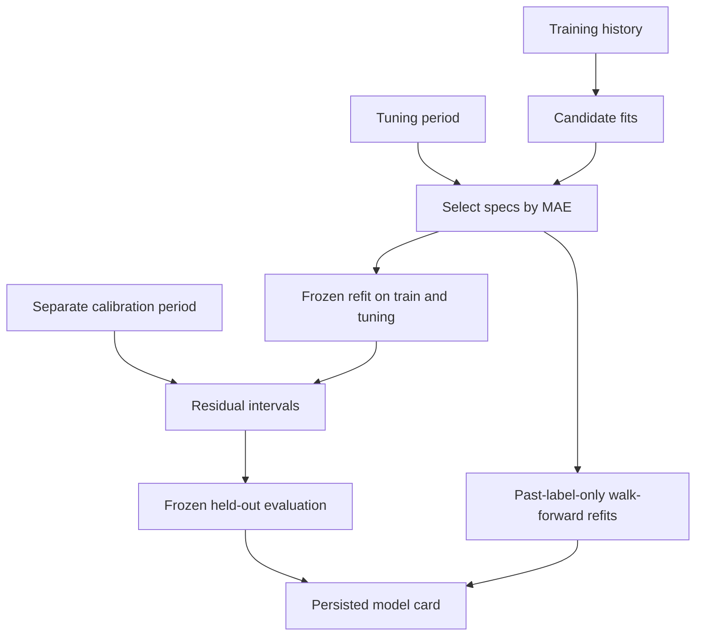

# Architecture

## System boundary

The database is an embedded single-process Go engine. The market package is a
domain layer, not a fork of the storage engine. It uses public transactions,
records, composite indexes, and scans in the same way an external application
would.

## Provider synchronization

`MarketDataProvider` separates orchestration from the provider SDK. The Twelve
Data implementation requests no more than 5,000 points per call, uses a shared
spaced limiter, retries transient network errors, HTTP 429, and HTTP 5xx with
bounded exponential backoff, honors `Retry-After`, limits response bodies, and
redacts the configured API key from provider errors.

`SyncService` converts the requested range into bounded, inclusive windows. It
commits each candle page before advancing its durable checkpoint. If the
process stops between those two commits, the next run replays the page safely
because candle and corporate-action writes are idempotent. A two-period resume
overlap also allows recently corrected bars to be updated.

## Storage model

Prices use `PriceScale = 1,000,000`. A stored close of `123,456,789` means
`123.456789` currency units. Returns, volatility, confidence, sentiment, and
RSI use parts per million (`RatioScale = 1,000,000`). Floating-point arithmetic
is restricted to feature calculation and presentation; persisted values are
deterministic integers.

| Table | Primary key | Purpose |
| --- | --- | --- |
| `market_schema_migrations` | `version` | Atomic application schema history |
| `market_instruments` | `symbol` | Tradable instrument metadata |
| `market_candles` | `symbol, interval, timestamp` | Source-labelled OHLCV history |
| `market_features` | `symbol, interval, timestamp, feature_set` | Versioned point-in-time feature snapshots |
| `market_model_runs` | `run_id` | Model, parameters, data hash, metrics, and status |
| `market_forecasts` | `run_id, symbol, interval, as_of_timestamp, horizon_seconds` | Predictions and later realized outcomes |
| `market_analyses` | `analysis_id` | LLM thesis, evidence, model/prompt identity, input digest |
| `market_ingestion_checkpoints` | `source, dataset, symbol, interval` | Resumable provider progress |
| `market_corporate_actions` | `symbol, action_type, ex_date, source` | Split/dividend lineage and exact factors |
| `market_data_quality_runs` | `report_id` | Coverage, missing/unexpected sessions, anomalies, and dataset hash |
| `market_ingestion_runs` | `run_id` | Job status, row counts, retries, credits, and bounded failure text |
| `market_feature_watermarks` | `symbol, interval, feature_set` | Durable incremental-computation progress |
| `market_model_artifacts` | `run_id, kind, chunk` | Checksummed predictors, cards, analyst inputs/reports and evaluations |
| `market_filing_sources` | `source_id` | Immutable SEC metadata, canonical URL, acceptance/first-observation times and digest (v4) |
| `market_service_jobs` | `job_id` | Durable queued/running/terminal work, request digest, and bounded result (v5) |
| `market_app_metadata` | `key` | Small versioned application manifests, including idempotent demo identity (v5) |

Secondary indexes support cross-sectional timestamp scans, model/status
queries, forecast evaluation by target timestamp, and analysis lookup by
symbol and time.

## HTTP and job boundary (Phase 5)

The server remains a single owner of the database file. Read routes execute
bounded indexed repository calls under request deadlines. Mutations commit a
small job record and return; a one-to-four-worker pool atomically claims work
from the same database. This is not a distributed queue. It demonstrates the
state machine and crash boundary before introducing external infrastructure.

An idempotency key is hashed and mapped to a deterministic job ID. Repeating the
same canonical request returns its original job, while a changed request
returns a conflict. Queued jobs remain queued across restart. Running jobs are
marked failed with `server_restarted`, because replaying a task after an unknown
partial side effect would make an exactly-once claim the engine cannot support.

HTTP concurrency, bodies, headers, query rows, worker counts, JSON control rows,
and shutdown are independently bounded. The API logs stable route templates,
not raw URLs, and gives clients a request ID without logging bearer tokens or
payloads. Prometheus exposition uses only bounded labels, preventing symbols or
arbitrary paths from creating unbounded metric cardinality.

The dashboard is embedded into the Go binary and shares the API origin. It uses
standards-based JavaScript and Canvas so the documented demo needs no npm/CDN
step. Go remains responsible for numeric values and audited claims; the browser
only formats stored records and draws their relationships.

## Correctness invariants

- A candle batch is fully validated before its transaction begins.
- OHLC prices must be positive; `high` and `low` must contain open and close.
- Re-importing the same candles is idempotent.
- Provider windows are bounded and filtered to the requested inclusive range.
- A checkpoint advances only after its candle page commits.
- Resume overlaps recent data and updates corrections without duplicating rows.
- Daily NYSE coverage distinguishes missing sessions from provider rows on
  non-session dates.
- Daily/weekly/monthly Twelve Data prices are not adjusted twice. Intraday
  split adjustment uses exact rational split factors from stored actions.
- Incremental features recompute with sufficient lookback context and update
  their watermark only after successful writes.
- Feature queries read only timestamps `<= as_of_timestamp`.
- A forecast keeps both `as_of_timestamp` and `target_timestamp`.
- Evaluation adds actual outcomes without replacing original model output.
- Each model run stores a deterministic SHA-256 hash of its candle dataset.
- Each LLM analysis stores the provider, model, prompt version, and SHA-256
  digest of its exact structured input.
- Storage commits retain the engine's copy-on-write, `fsync`, snapshot, and
  optimistic-conflict guarantees.

## LLM boundary

`LLMClient` is a dependency-injected interface. The native Ollama adapter sends
separate system/data messages with a JSON schema and no tool capabilities to a
local loopback server. SEC submissions retrieval is a separate explicit CLI job,
not a tool callable by the model. It stores metadata only, not filing contents.

The analyst reads candles, forecast lineage and filing sources from one database
snapshot and releases it before the model call. A dedicated forecast DTO excludes
all realized outcomes. The model selects evidence IDs and a constrained outlook;
Go validates completeness/consistency and renders numeric and filing claims.
The service rejects arbitrary prose rather than pretending citations validate it.

Schema-v4 source records preserve both acceptance and first-retrieved time. The
analysis, feature, exact input and full report commit atomically in the existing
chunked artifact store. Invalid responses receive at most three total attempts,
then an audited no-claims abstention. Legacy sentiment/confidence fields stay zero.
See [ANALYST.md](ANALYST.md) for temporal rules, bounds, evaluation and API changes.

## Prediction experiments (Phase 3)

The prediction service takes one indexed candle snapshot (at most 20,000 bars),
creates seven fixed-order origin-time features from 21-bar windows, and labels
each origin with the log return to the next configured observed bar. It rejects
mixed sources, mixed symbols/intervals, invalid prices, and non-increasing times.

The default 60/20/20 chronological split divides the middle 20% into tuning and
calibration halves. Samples whose labels meet or cross the following origin
boundary are purged. Ridge standardization is fit only on the current training
slice. Hyperparameters are never chosen using calibration or test results.

Each model has a frozen run and one run per walk-forward refit. Those runs store
the true last training-label timestamp, configuration, metrics, and training
hash. `market_model_artifacts` stores complete predictors and experiment cards
in 1,800-byte chunks with a complete-payload SHA-256 checksum, fitting the engine's
3,000-byte value limit. Each child run, artifact, and forecast batch commits
atomically. The parent card and completed status commit together after all
children succeed; cancelled/failed experiments preserve completed child runs
for inspection and record a failed parent status.

`PredictNextDaily` loads a stored predictor, checks calibration time against the
chosen completed origin, uses the same feature mapping as training, and chooses
a future NYSE session using the configured observed-bar horizon. It never refits
or consults future prices. Repeated insertion cannot overwrite original output.

## Known limits

- One process may open a database file at a time.
- The Phase 5 queue is local to that one process; it is durable but not distributed.
- Mutation auth is one configured bearer token, not a user/role system. TLS is expected at a trusted proxy and is not implemented by this student server.
- SQL is the book's simplified dialect; the market repository uses typed APIs.
- Twelve Data is the only live market-data adapter; adding another provider
  requires implementing `MarketDataProvider`.
- The exchange calendar covers NYSE daily sessions and known full-day special
  closures. It does not model early closes, non-US exchanges, or intraday gaps.
- Provider sync is sequential across symbols so one limiter owns the account
  budget. It is intentionally conservative, not a high-throughput downloader.
- Corporate-action adjustment covers splits for intraday adjusted-close
  reconstruction; dividend total-return adjustment is not claimed.
- The LLM adapter is local Ollama only. Real-model quality is not established by
  deterministic fixtures; live acceptance is explicitly pending.
- Analyst output is controlled-language, daily-bar research commentary. SEC
  metadata is not a substitute for reading filings or analyzing trusted news.
- Technical features are a starting set, not evidence of profitable alpha.
- Model selection uses tuning data, and the final report can honestly show a
  selected model losing to persistence. Single-asset error reductions do not
  establish statistical significance or profitability.
- Empirical residual intervals do not guarantee coverage for dependent,
  nonstationary time series. No trading costs, slippage, or execution is modeled.
- Vendor-adjusted/revised history is not vintage point-in-time market data.
- Saved-model live forecasting currently supports daily bars and an explicitly
  supplied exchange calendar; the CLI uses NYSE. Callers must choose completed bars.
