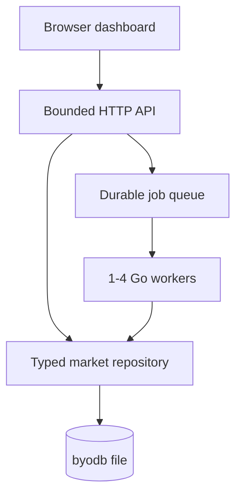
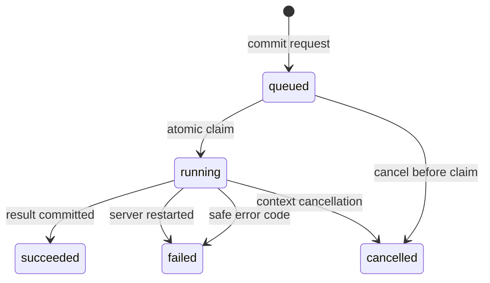

# Service, dashboard, and Phase 6 replica runbook

Phase 5 turns the embedded database into a single-process application service.
It is deliberately small enough to explain at a whiteboard: Go's `net/http`, a
durable queue stored in byodb, one bounded worker pool, an offline browser UI,
and no ORM, message broker, JavaScript package manager, or managed database.

The system is an educational research project, not financial advice or a
production trading platform.

## One-command demonstration

From an empty directory inside the repository:

```sh
go run ./cmd/marketserver -db service-demo.db -seed-demo
```

Open <http://127.0.0.1:8080>. The first start creates schema v5 and the complete
synthetic workflow: 600 daily candles, point-in-time features, chronological
model selection and evaluation, a saved predictor, a next-session forecast,
and a fixture-based grounded analyst audit. Later starts reuse a small manifest;
they do not silently retrain or duplicate experiments.

The equivalent container command is:

```sh
docker compose up --build
```

The Compose port binds to loopback only, drops Linux capabilities, uses a
read-only root filesystem, runs as a non-root user, and stores the database in a
named volume. Stop with `Ctrl+C`; use `docker compose down` to remove the
container while keeping the volume. Add `-v` only when you intentionally want
to delete the demo database.

## Runtime topology



One writing process owns the database file under an exclusive OS lock. A second
writer—or a reader pointed at that same live file—is rejected immediately.
Read-only services use an independent point-in-time snapshot, described below.
A queue is still useful because long ingestion/model tasks should not occupy an
HTTP request or disappear when a client disconnects.

## Point-in-time read-only service

Stop the CLI-owned writer, create a snapshot, and serve it on another port:

```sh
go run ./cmd/byodb -db service-demo.db -backup service-replica.db
go run ./cmd/marketserver \
  -db service-replica.db -read-only -addr 127.0.0.1:8081
```

`-read-only` validates the existing schema, starts no background workers,
ignores `MARKET_API_TOKEN`, and serves dashboard/GET/observability routes.
`-seed-demo` is rejected in this mode. Multiple read-only processes can share
the replica file, although independent files are preferable for deployment.

The external CLI cannot snapshot a file while another process owns its writer
lock. An application already embedding the live writer can call
`db.Backup("replica.db")`; that method serializes against commit, fsyncs a
temporary file, and publishes it by rename. This is a full snapshot and manual
refresh, not log shipping or live replication.

## API contract

Every JSON response has `data` plus `request_id`, or `error` plus `request_id`.
Clients may send an 8-64 character `X-Request-ID`; invalid values are replaced.
The complete machine-readable contract is [openapi.yaml](openapi.yaml).

| Route | Purpose | Mutation token |
| --- | --- | --- |
| `GET /healthz` | Process liveness | No |
| `GET /readyz` | Schema and storage readiness | No |
| `GET /metrics` | Prometheus text format | No |
| `GET /api/v1/capabilities` | Enabled background-job kinds | No |
| `GET /api/v1/overview` | Bounded candles and dashboard summaries | No |
| `GET /api/v1/model-cards/{id}` | Complete persisted evaluation evidence | No |
| `GET /api/v1/analyses/{id}` | Complete analyst input/output audit | No |
| `POST /api/v1/jobs` | Submit durable work | Yes |
| `GET /api/v1/jobs/{id}` | Poll durable state | No |
| `POST /api/v1/jobs/{id}/cancel` | Cooperative cancellation | Yes |

Query bounds are part of correctness, not just performance. Overview limits are
21-500 candles, request bodies are at most 64 KiB, persisted job payloads/results
are at most 1,536 bytes, headers are capped at 32 KiB, and the default API
deadline is ten seconds. Long computation only runs in a worker.

## Durable job semantics



- The HTTP response is sent only after the queued record commits.
- `Idempotency-Key` is SHA-256 hashed; the original token is never stored.
- Reusing a key and identical canonical request returns the original job.
- Reusing it for different work returns HTTP 409.
- Queued jobs survive restart. A job found in `running` is marked
  `server_restarted`, not blindly replayed after a partial side effect.
- Cancellation is immediate for queued work and cooperative for running work.
- Error responses expose stable codes. Logs retain job identity and the safe
  code without copying raw upstream bodies or user payloads.

Built-in kinds are `seed_demo`, `recompute_features`,
`prediction_experiment`, `predict`, and `evaluate_forecasts`. `provider_sync`
appears only when `TWELVE_DATA_API_KEY` is configured. `grounded_analysis`
appears only when `OLLAMA_MODEL` configures the local, loopback-only Ollama
adapter. That adapter is intended for a native server run; the hardened Compose
demo does not route a container back to a host Ollama process.

Enable mutations with an environment variable; the token is intentionally not
a command-line flag because process arguments may be visible to other users:

```sh
export MARKET_API_TOKEN="replace-with-a-long-random-token"
go run ./cmd/marketserver -db service-demo.db -seed-demo

curl -i -X POST http://127.0.0.1:8080/api/v1/jobs \
  -H "Authorization: Bearer $MARKET_API_TOKEN" \
  -H "Idempotency-Key: features-SYNTH-2026-09-01" \
  -H "Content-Type: application/json" \
  -d '{"kind":"recompute_features","payload":{"symbol":"SYNTH","interval":"1d"}}'
```

When `MARKET_API_TOKEN` is absent, every mutation returns
`mutations_disabled`; read-only dashboard and observability routes continue to
work. The API sends no permissive CORS headers and rejects cross-origin browser
mutations even when a bearer token is present.

## Configuration

| Setting | Default | Reason |
| --- | --- | --- |
| `-addr` | `127.0.0.1:8080` | Safe local binding |
| `-workers` | `1` | Matches the educational engine's write profile |
| `-read-only` | `false` | Serve an existing snapshot with no workers/mutations |
| `-request-timeout` | `10s` | Bounds synchronous API work |
| `-shutdown-timeout` | `15s` | Allows HTTP and workers to stop cleanly |
| `-max-in-flight` | `64` | Rejects overload instead of exhausting memory |
| `MARKET_API_TOKEN` | unset | Mutations disabled by default |
| `TWELVE_DATA_API_KEY` | unset | Provider sync capability disabled |
| `OLLAMA_MODEL` | unset | Live LLM capability disabled |

The dashboard uses standards-based JavaScript and Canvas rather than React. The
tradeoff is intentional for this phase: the binary embeds the exact offline
assets it serves, so `go run` remains the entire build and a CDN/npm outage
cannot break the demo. The UI still demonstrates responsive layout, accessible
markup, stateful fetch/cancellation, typed API boundaries, and custom chart
rendering. A framework migration would change presentation tooling, not the
service contract.

## Observability and load testing

Logs are one JSON object per line. Request logs use route templates rather than
raw query strings and contain request ID, method, status, response bytes, and
duration. Job logs contain IDs, kind, terminal status, safe error code, worker,
and duration. Credentials and request bodies are not logged.

Prometheus exposition includes request counts/duration totals, active requests,
job outcomes/active workers, allocated/free database pages, schema, and build
version:

```sh
curl http://127.0.0.1:8080/metrics
```

Run the checked-in read-only load generator against the seeded service:

```sh
go run ./cmd/marketload -duration 10s -concurrency 16
```

It prints JSON with request count, errors, throughput, p50/p95/p99 latency,
status distribution, and bytes read. Record the machine, Go version, commit,
command, and raw output before placing any number on a résumé.

## Graceful shutdown and failure boundaries

`SIGINT`/`SIGTERM` stop new work, ask the HTTP server to drain, cancel active
jobs, wait within the configured budget, then close the database. Windows uses
`os.Interrupt`; directory syncing is separately selected by build tags because
Windows cannot call `Sync` on an open directory through Go's standard library.
The database file itself is still synced at its durability boundaries.

The engine now prevents unsafe multiple owners and can serve point-in-time
replicas, but it does not add TLS, users/roles, live replication, distributed
workers, or exactly-once external side effects. A production TLS/auth proxy
would not turn the educational engine into an internet-facing trading service.
See [DURABILITY.md](DURABILITY.md) before making a persistence claim.
